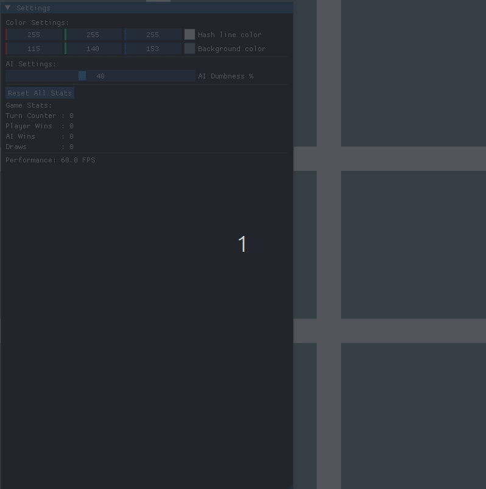

# MinimaxGL: OpenGL Tic-Tac-Toe AI Engine

A high-performance, cross-platform Tic-Tac-Toe engine built with **Modern C++17**, **OpenGL 3.3**, and the **Minimax algorithm**. This project demonstrates core game engine architecture, including shader management, texture mapping, and an interactive GUI.

<p align="center">
  
</p>

---

## 🚀 Key Features

### Recursive Minimax AI
- **Unbeatable Core:** Logic based on the recursive **Minimax algorithm** that evaluates all possible board states.
- **Dynamic Difficulty:** Adjustable **AI Dumbness slider** via the GUI to introduce a controlled probability of non-optimal moves.

### Modern OpenGL 3.3 Backend
- **Programmable Pipeline:** Custom **GLSL shaders** for grid lines and game pieces.
- **Efficient Rendering:** Hardware-accelerated rendering using **Vertex Buffer Objects (VBOs)**.

### Interactive GUI
Powered by **Dear ImGui** for real-time interaction:
- Live color picking for background and grid lines
- Persistent game statistics (Wins / Losses / Draws)
- On-the-fly AI difficulty adjustment

### Engineering Polish
- **Frame Independence:** Implemented **Delta Time** to decouple game logic from monitor refresh rate.
- **Portable Resource Management:** Robust path resolution using `std::filesystem` so the binary locates assets relative to the executable.

---

## 🛠️ Tech Stack

| Component | Library |
| :--- | :--- |
| Language | C++17 |
| Graphics API | OpenGL 3.3 (Core Profile) |
| Windowing/Input | GLFW 3 |
| OpenGL Loader | GLAD |
| UI Library | Dear ImGui |
| Build System | CMake & Ninja |

---

## 📦 Build Instructions

### Prerequisites (Linux)

Ensure the following dependencies are installed:

```bash
sudo apt update
sudo apt install build-essential cmake ninja-build libglfw3-dev
```

### Compilation & Launch

The project includes automation scripts to handle the CMake configuration and Ninja build process.

Clone the repository:

```bash
git clone <repository_url>
cd GL-Minimax
```

Configure the project:

```bash
chmod +x config.sh
./config.sh
```

Build and run:

```bash
chmod +x run.sh
./run.sh
```

---

## 📁 Project Structure

```text
.
├── dependencies/
│   ├── glad/
│   ├── imgui/
│   └── stb-master/
├── docs/
│   └── demo.gif
├── include/            # Header files (.h)
├── resources/
│   ├── shaders/
│   └── Textures/
├── src/                # Implementation files (.cpp)
├── .clang-format
├── .gitignore
├── CMakeLists.txt
├── config.sh           # Configuration automation
├── format.sh           # Code formatting script
├── LICENCE
├── README.md
└── run.sh              # Build and execution automation
```
